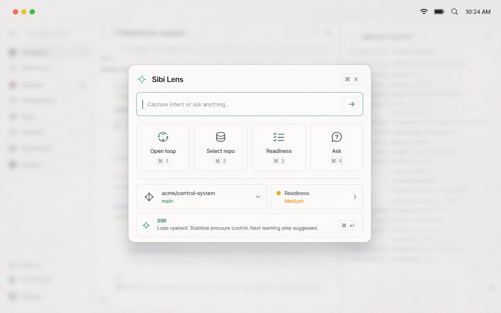
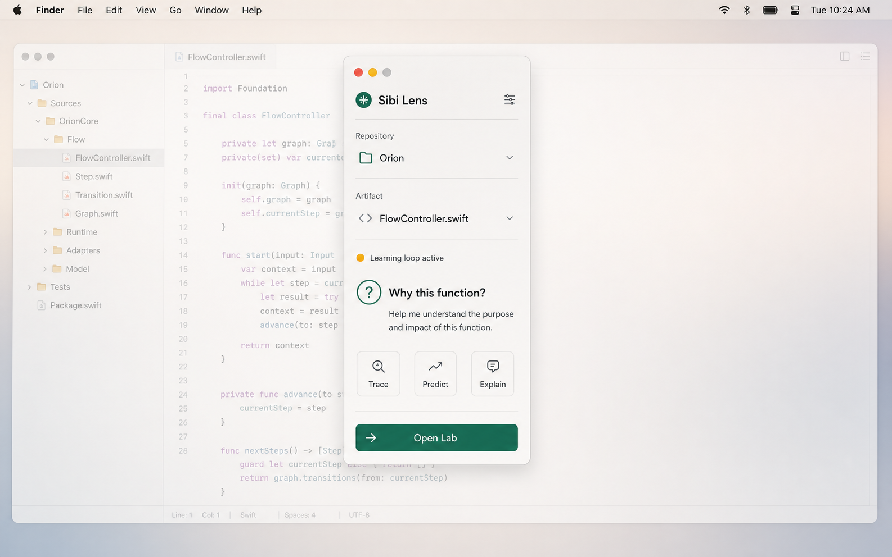
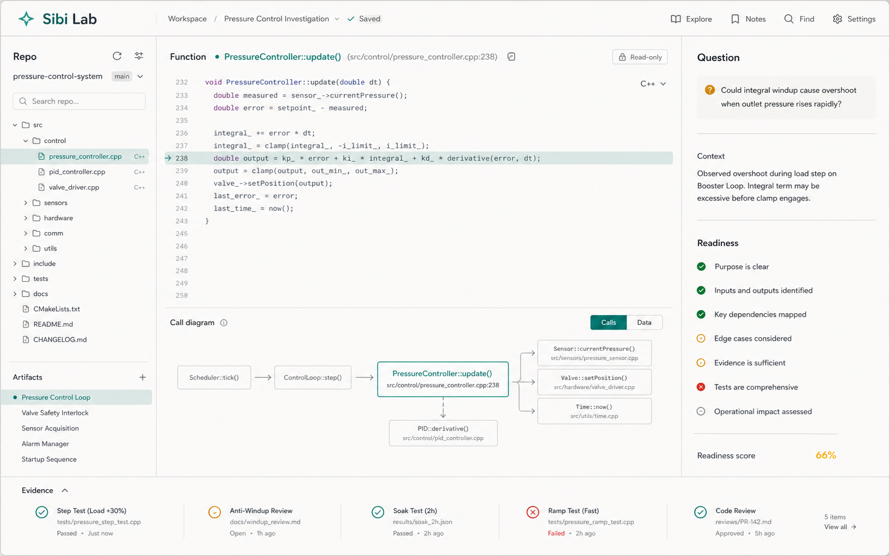
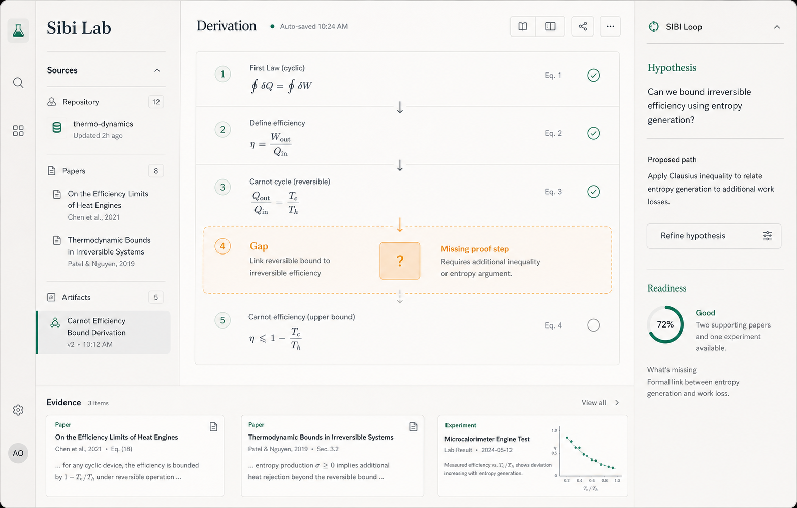
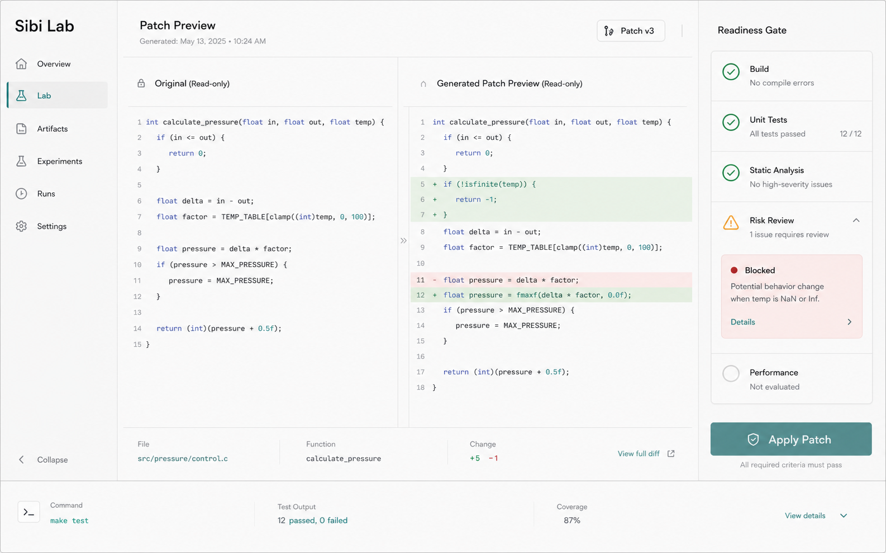
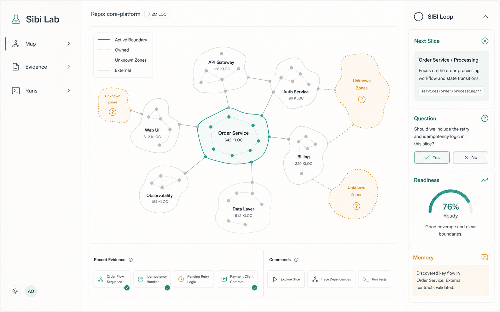

# Sibi UI Iterations: Lens + Lab

This iteration explores Sibi as two surfaces:

- `Sibi Lens`: a fast floating macOS panel for capture, repo/artifact selection, one question, readiness, and opening the next loop.
- `Sibi Lab`: a larger research workbench for structured artifacts, evidence, gaps, hypotheses, and readiness. It is code-aware, but not a production editor.

The main design rule across all variants is panel restraint: one dominant artifact, one Sibi loop, one evidence/readiness surface, and progressive disclosure for everything else.

## Variations

### 01. Sibi Lens: Command Surface

Intent: Raycast-like `NSPanel` for fast intent capture without becoming a dashboard.

### 02. Sibi Lens: Question Gate

Intent: one precise thinking checkpoint before opening the bigger Lab.

### 03. Sibi Lab: Code Workbench

Intent: read-only code slice, call context, one question, readiness, and a collapsed evidence strip.

### 04. Sibi Lab: Derivation Artifact

Intent: paper/math state with a derivation ladder, one highlighted gap, and compact evidence.

### 05. Sibi Lab: Patch Readiness

Intent: generated practice patch preview gated by readiness instead of full editor ownership.

### 06. Sibi Lab: Repo Overview Map

Intent: large-repo ownership map with unknown zones, active boundary, next slice, and memory.

## Product Decision Captured

Sibi should not start as an editor. It should start as a lab for technical ownership that can inspect code, papers, experiments, and artifacts, then hand off editing to the user's existing editor until readiness justifies applying a patch.

## UI Constraints

- Avoid chat as the main surface.
- Avoid a wall of panels, cards, metrics, and feature drawers.
- Keep the center as the artifact canvas.
- Keep Lens small enough to feel interruptible.
- Keep Lab structured enough for serious work without turning into an IDE clone.
