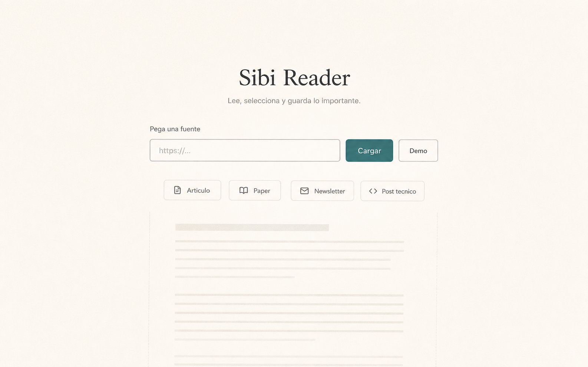
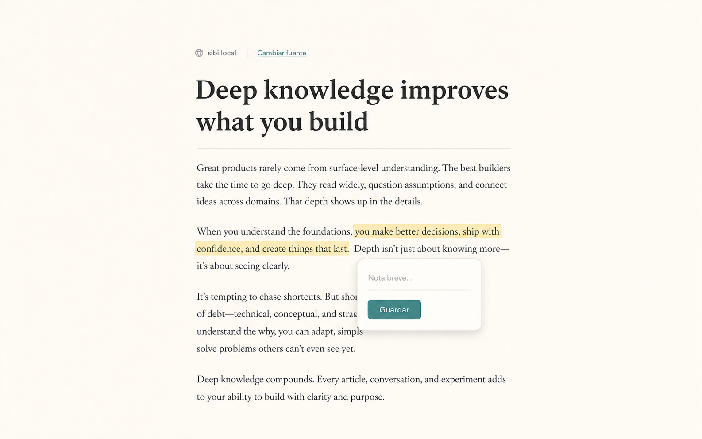
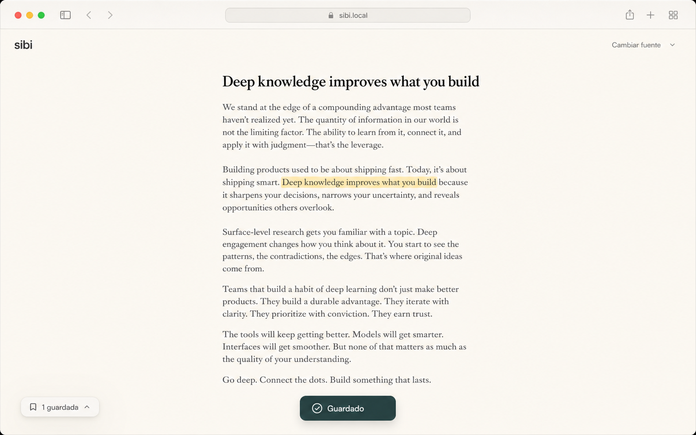

# Web Reader Source Ingestion Iteration

Status: product direction draft  
Date: 2026-05-15

## Decision

The web reader should treat source ingestion as the first product moment, not as
a utility field in a permanent app bar.

When the user opens the reader with no article loaded, the interface should
center the URL input near the future reading surface and give a few lightweight,
non-personalized examples of source types. The goal is to reduce the "what am I
supposed to paste?" pause without pretending to know the user.

Once an article is loaded, source ingestion should recede. The user should feel
like they are reading, selecting, and saving directly. Classification labels such
as Highlight, Question, and Idea should not be required in the focused reader
flow.

## Product Rationale

An empty URL input asks for a technical action. A source-ingestion moment asks
for a user intention: bring something worth reading.

Consumer products often reduce first-action friction by showing shelves,
suggestions, or examples. For Sibi, this should not become a recommendation feed.
With no profile data, the honest version is a small set of universal source
types that teach what belongs in the reader:

- Article
- Paper
- Newsletter
- Technical post

These suggestions should orient the user, not add new capabilities. They can be
static labels, example chips, or later affordances, but the product promise stays
simple: paste a source, read, select, save.

## Non-Goals

- Do not add personalized recommendations without profile context.
- Do not add a search engine, feed, or source marketplace.
- Do not require the user to classify saved text as Highlight, Question, or Idea.
- Do not show persistent side panels in the focused reader flow.
- Do not introduce AI summaries, chat, analytics panels, or note management as
  first-screen concepts.

## Proposed States

### 1. First Open

The first screen is a calm reader start state:

- `Sibi Reader` label.
- A centered URL input with `Cargar` and `Demo`.
- A short line: `Lee, selecciona y guarda lo importante.`
- Four lightweight source-type examples.
- A faint hint of the future reading surface below the input.

Mockup:

Coded prototype: [source-ingestion-start.html](prototypes/source-ingestion-start.html)

### 2. Reading

After loading, ingestion recedes into a small source row near the article:

- Host/source identity.
- Quiet `Cambiar fuente` affordance.
- Article content is primary.
- Selecting text shows one direct save action.
- No category selector.

Mockup:

Coded prototype: [source-ingestion-start.html](prototypes/source-ingestion-start.html)

### 3. Saved

After saving, the reader stays in flow:

- Saved text is subtly marked.
- A small `Guardado` confirmation appears.
- A collapsed saved-count chip can acknowledge saved material without opening a
  side panel.

Mockup:

Coded prototype: [source-ingestion-start.html](prototypes/source-ingestion-start.html)

## Acceptance Criteria

- First-open state makes the paste action obvious without a marketing hero.
- Source examples are generic and non-personalized.
- Loaded state removes first-open suggestions.
- Save flow has one primary action and does not require category selection.
- Reader remains usable without side panels on desktop and mobile.
- Existing capabilities remain bounded to source load, demo, reading,
  selection, direct save, and local persistence.

## Imagegen Prompt Set

The mockups were generated with the built-in `imagegen` skill as three UI mockup
states:

1. First open / source ingestion: centered URL input, static source-type
   examples, no side panels.
2. Source loaded / reading: source row recedes, article dominates, selected text
   exposes a direct `Guardar` action.
3. Saved / quiet continuation: subtle saved highlight, small confirmation, and a
   collapsed saved-count chip.
