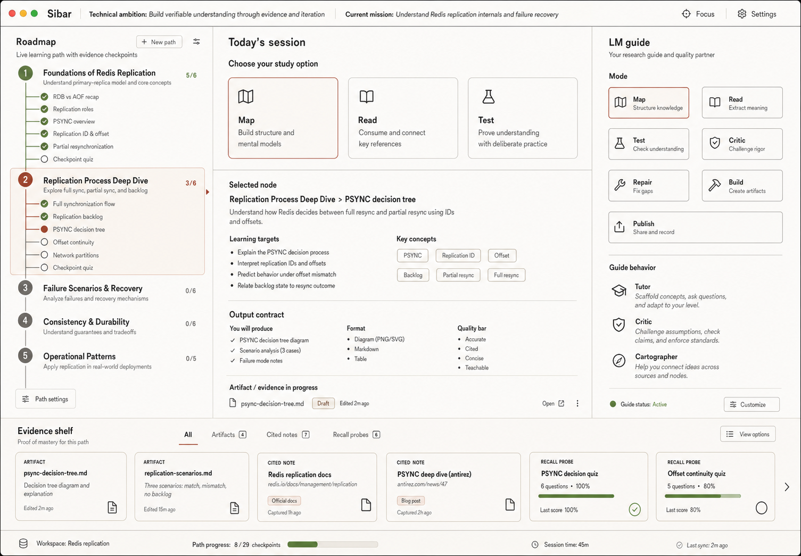

# Sibar Research Workspace UI/UX Report

Date: 2026-05-20

## Scope

This report covers the static Tauri research workspace prototype in
`apps/sibar-research-workspace`. The design target is a native formation
workspace for becoming a researcher, centered on:

`Mission -> Roadmap -> Learning Node -> Session -> Artifact -> Evidence -> Recall`.

## Image-first reference

Generated visual reference:

The mockup established the working direction:

- A native studio surface with mission context in a thin top bar.
- A left roadmap that reads as a live learning path, not a generic metric tree.
- A central session workbench where the main question is what to study now.
- A right LM guide with bounded modes (`map`, `read`, `test`, `critic`, `repair`, `build`, `publish`) instead of an infinite chat stream.
- A bottom evidence shelf where artifacts, cited notes, and recall probes are proof of mastery.

The implemented variation keeps the app's existing neural-net research fixture
instead of copying the Redis sample content from the generated image.

## Current UI diagnosis

- The product contract is strong: roadmap, active reader, LM modes, attempts,
  artifacts, evidence, and compiler payloads already exist.
- The first screen previously felt closer to a functional test harness than a
  research studio because the compiler controls competed with the active session.
- "What should I study now?" was not sufficiently explicit. The UI showed many
  valid operations at the same priority.
- The blue/teal palette and rounded dashboard panels made the surface feel more
  like a generic AI dashboard than a native learning/research workspace.
- Evidence existed, but it read as a lower strip rather than the outcome of the
  whole formation loop.

## Redesign principles

- Put mission context in a compact native bar, not a hero.
- Make the active learning artifact the central unit.
- Show no more than three primary next-study choices.
- Treat the LM as tutor, critic, and cartographer through bounded tools.
- Subordinate source compilation under the session instead of letting it dominate.
- Keep artifact/evidence/recall visible as proof of mastery, not decoration.
- Use warm research-studio materials, charcoal text, clay accent, and olive
  readiness states; avoid purple/blue AI-gradient cues.

## Implemented variation

- Replaced the large top banner with a compact mission bar and a "Today" band.
- Added three visible study choices: study now, build proof, recall gate.
- Renamed the central panel to `SESSION / WORKBENCH` and made its output contract
  read as read/build/prove.
- Moved source-to-roadmap compiler controls into a collapsible drawer so the
  current session remains primary.
- Simplified the visible LM guide copy into bounded guide behavior and retained
  the existing mode machinery.
- Updated the artifact strip title to include recall as a first-class output.
- Reworked CSS tokens and layout toward a warm native workspace with tighter
  radii, stronger boundaries, and no generic blue dashboard palette.

## Recommendations for functional connection

- Wire the three study-choice buttons to actual selection state:
  current recommended mini-node, artifact build scope, and recall gate.
- Promote `max_visible_choices: 3` from policy data into the UI renderer so the
  choice row is generated from the current decision state.
- Add a typed artifact/evidence model for the bottom shelf so each artifact can
  show provenance, cited source, readiness, and recall status.
- Make LM modes produce structured side effects in the workbench rather than only
  log text: map changes roadmap focus, critic opens gap evidence, repair creates
  a smaller session, publish validates evidence.
- Add a lightweight visual regression/screenshot check once the prototype has a
  stable browser harness.

## Risks and debt

- The study-choice row is currently visual/static; it should become state-driven
  before relying on it as production navigation.
- The compiler drawer still exposes raw JSON payloads, which is useful for
  validation but too low-level for a final learner-facing workspace.
- The roadmap tree can still become dense when imported artifacts include many
  sources; it needs progressive disclosure rules per level.
- The evidence shelf uses simple lists; it should become a real artifact/evidence
  ledger before shipping.
- The visual reference and implementation intentionally diverge in content, so
  future design work should generate a reference using the final Sibar fixture.
